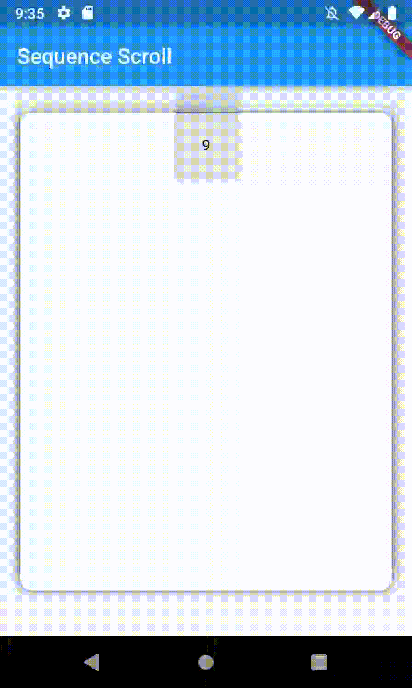

# Sequence Scroll

A widget for scroll items in sequence.
Adopted from chrome tabs.

## How to use it

Till now there is no package to use but you can clone the RB/files and use it in very simple way.
Just import files in the right way.

```dart
Expanded(
  child: SequenceList(
    /////////////////////////// REQUIRED ///////////////////////////

    // basically it's the tab/item height
    minTabHeight: tabHeight,
    // Specify the space required  between tab/item and the next one to start move
    maxSpaceBetweenTwoTabs: tabHeight * .25,
    // Min space between two tabs
    minSpaceBetweenTwoTabs: 5,
    // the context
    context: context,
    tabsContent: List.generate(
      10,
      (i) => Align(
        alignment: Alignment.topCenter,
        child: Container(
          height: 60,
          width: 60,
          child: RaisedButton(
            child: Text(i.toString()),
            onPressed: () => print('hello from $i'),
          ),
        ),
      ),
    ),

    /////////////////////////// OPTIONAL ///////////////////////////

    // Basically it's the tab/item width otherwise it will take 75% of the view width
    minTabWidth: MediaQuery.of(context).size.width * .9,

    // Means that min space will be applied till the tab ${4}, other tabs will be above each other [max: items length - 1]
    applyMinSpaceTill: 4,

    // Container of the full list decoration
    listContainerDecoration: BoxDecoration(),

    // To specify the decoration for each item container
    itemDecoration: BoxDecoration(
      boxShadow: [
        BoxShadow(
          blurRadius: 8,
          color: Colors.black12,
        ),

      ],
      color: Colors.white,
      borderRadius: BorderRadius.circular(10)
    ),
  ),
)
```

## Preview



## Still in **DEVELOPMENT**

You could use it if you want but you might face **UNKNOWN** issue,
if you face one tell me and i will look at it
